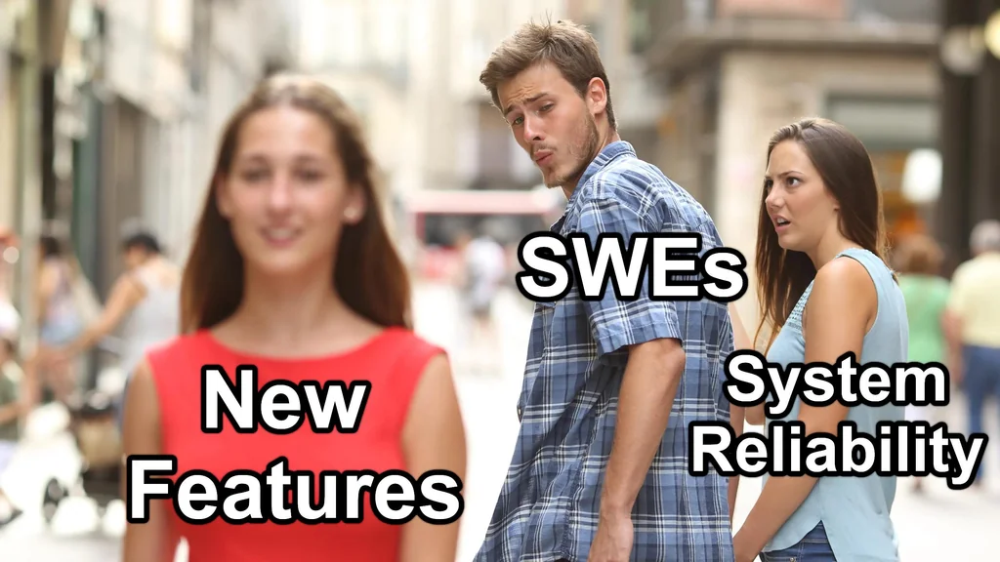

# <h1 align="center">Sup 👋.  I'm [Julius](https://juliusbautista.com/)...</h1>

### 
...Filipino-American USMC veteran, programmer, visual artist, and educator...

### 
...and I'm passionate about storytelling, education and examining how our experiences impact our lives.

---

---

### <h3 align="center">Currently, I am a:</h3>

### 
 Site Reliability Engineer @ Enova International   Lead Dev Ops Instructor @ Code Platoon

## <h2 align="center" >...and doing what I can to advocate for and promote DevOps culture & practices despite the uphill battle :)  </h2>

---

### <h3 align="center">Need a developer, instructor or designer?</h3>
### <h3 align="center">Let's connect on [LinkedIn](https://www.linkedin.com/in/juliusdcbautista/).</h3>

---
### <h3 align="center">Also Currently...</h3>

---
<!--
**jdcbautista/jdcbautista** is a ✨ _special_ ✨ repository because its `README.md` (this file) appears on your GitHub profile.

Here are some ideas to get you started:

- 🔭 I’m currently working on ...
- 🌱 I’m currently learning ...
- 👯 I’m looking to collaborate on ...
- 🤔 I’m looking for help with ...
- 💬 Ask me about ...
- 📫 How to reach me: ...
- 😄 Pronouns: ...
- ⚡ Fun fact: ...
-->

### <h3 align="center">A Little More About Me, Recreationally</h3>

| 🎵 **Favorite Music** 🎵| 🎬 **Favorite Films** 🎬 | 📺 **Favorite TV Shows** 📺 | 📚 **Favorite Non-fiction Books** 📚 |
|:------------------------|:------------------------|:------------------------|:------------------------|
| Four Tet | Waking Life | Homeland | The Culture Code |
| The Strokes | Dancer in the Dark | Mad Men | Thinking, Fast and Slow |
| Blonde Redhead | Akira | Law and Order | Becoming Nobody |
|                       |                        |                        |                        |
| 📖 **Favorite Fiction Books** 📖 | 🍹 **Favorite Drinks** 🍹 | 🍕 **Favorite Foods** 🍕 | 🏃‍♂️ **Favorite Activities** 🏃‍♂️ |
| The Unconsoled | Whiskey on the rocks | Tamarind Stew with sticky white rice | Long runs |
| Never Let Me Go | Gin & club soda | Deep dish pizza | Dive bars |
| 1984 | Guinness Draught | Steak tacos | Art shows, galleries & museums |

